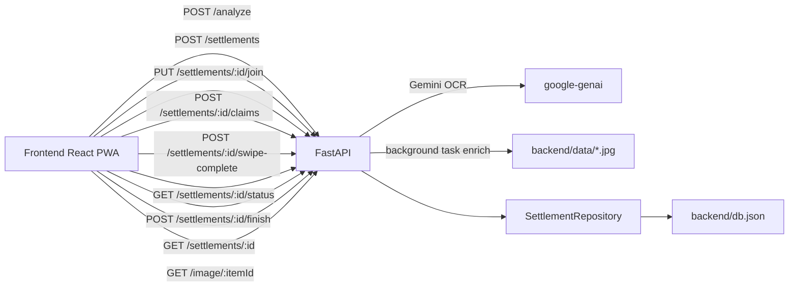

# give-me-the-money (fAIrsplit)

AI-assisted bill splitting app with:
- `backend/`: FastAPI + Gemini OCR + settlement APIs
- `frontend/`: React/Vite mobile-first PWA for host/guest split flows

## What Works Today

Main happy path (frontend + backend connected):
1. Host opens `/scan`, uploads receipt image.
2. Frontend sends `POST /analyze`.
3. Backend parses receipt with Gemini OCR and returns line items.
4. Host reviews/edits lines on `/review` and creates settlement with `POST /settlements`.
5. Host shares QR/link (`/share/:settlementId`).
6. Guest joins via `/split/:settlementId` (`PUT /settlements/{id}/join`).
7. Guest claims items on `/swipe/:settlementId` (`POST /settlements/{id}/claims`).
8. Host monitors completion on `/settlement/:settlementId/status`.
9. Host finishes settlement (`POST /settlements/{id}/finish`) and sees `/summary`.

## Architecture (Current)



## Repo Structure

```text
.
├── backend/
│   ├── app/
│   │   ├── api.py                 # HTTP routes
│   │   ├── services.py            # settlement summary logic
│   │   ├── database/              # JSON-file persistence
│   │   └── image_processing/      # OCR + optional enrich/verification/image-gen
│   ├── tests/
│   └── scripts/parse_receipt.py   # CLI for OCR/enrichment/image generation
├── frontend/
│   ├── src/pages/                 # host/guest flows
│   ├── src/lib/                   # API clients, mock store, URL/session helpers
│   └── src/components/
├── docker-compose.yml             # backend service
└── justfile                       # common commands
```

## Prerequisites

- Python `3.13`
- `uv`
- Bun `1.3.x`
- Docker + Docker Compose (optional)
- `just` (recommended)
- Gemini API key (`GEMINI_API_KEY`) for real receipt OCR

## Quick Start

1. Install backend deps:
```bash
cd backend
uv sync
cp .env.example .env
# set GEMINI_API_KEY in .env
```

2. Install frontend deps:
```bash
cd ../frontend
bun install
cp .env.example .env
```

3. Run backend:
```bash
cd ..
just serve-backend
```

4. Run frontend:
```bash
cd frontend
bun run dev
```

5. Open app:
- frontend: `http://127.0.0.1:5173`
- backend health: `http://127.0.0.1:8000/health`

## Testing and Quality

- Backend tests:
```bash
just test -q
```

- Frontend tests:
```bash
cd frontend
bun run test
```

- Pre-commit hooks:
```bash
just pre-commit
```

## Unfinished / Not Fully Integrated Paths

Important gaps beyond the main happy path:

- Restaurant web-search verification exists in backend (`verify_restaurant_lookup.py`) but is not called by API routes.
- Gemini-generated food images exist (`generate_receipt_images.py`) but are not used by API routes.
- `/analyze` currently returns hardcoded venue name (`"Pizzeria"`) instead of OCR restaurant name.
- `/analyze` response currency is effectively hardcoded to `PLN` in current conversion logic.
- `/image/{image_id}` serves copied placeholder images from `backend/data/`, not model-generated or receipt-derived images.
- Background `enrich()` in `/analyze` currently copies static files and contains `# TODO Update it`.
- Persistence is a single JSON file (`backend/db.json`) with no locking/transactions.
- Settlement claim validation is minimal in backend (no strict upper bound against item count).
- Frontend has stub fallback data in `/summary` when opened without navigation state.
- No authentication/authorization; anyone with settlement ID can join/claim.
- Status synchronization is polling-based (2.5s), no websocket/realtime updates.

## Docker

```bash
just up -d
just health
just down
```
