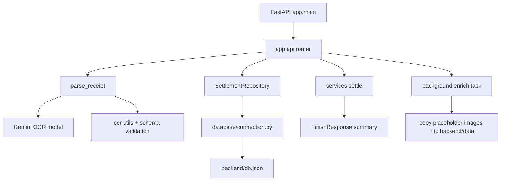
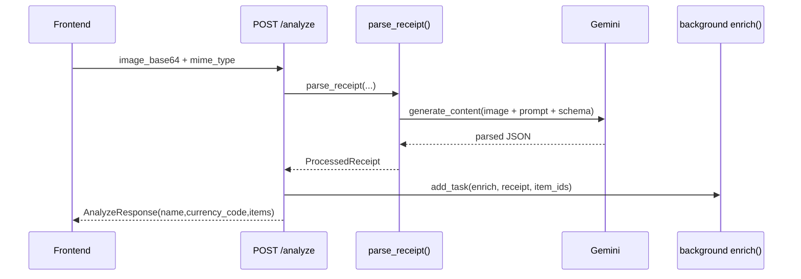

# Backend

FastAPI backend for:
- receipt OCR (`POST /analyze`)
- settlement lifecycle (`/settlements/...`)
- item image lookup (`GET /image/{image_id}`)

## Stack

- Python `3.13`
- FastAPI
- `uv` dependency/runtime manager
- Gemini via `google-genai`
- Optional Google ADK web-search tooling (`google-adk`)
- File-based persistence: `backend/db.json`

## Run Locally

From repo root (preferred):

```bash
just serve-backend
just health
```

From `backend/` directly:

```bash
uv run uvicorn app.main:app --host 127.0.0.1 --port 8000
curl -fsS http://127.0.0.1:8000/health
```

## Test

From repo root:

```bash
just test -q
```

From `backend/`:

```bash
uv run pytest -q
```

## API Surface (Current)

- `GET /health`
- `POST /analyze`
- `GET /image/{image_id}`
- `POST /settlements`
- `GET /settlements/{id}`
- `PUT /settlements/{id}/join`
- `POST /settlements/{id}/claims`
- `POST /settlements/{id}/swipe-complete`
- `GET /settlements/{id}/status`
- `POST /settlements/{id}/finish`

## Backend Architecture



## Receipt Analyze Flow



## Data Model Notes

`Settlement` stores:
- `items`: receipt lines with `id`, `name`, `price`, `count`
- `users`: owner + joined participants
- `assignments`: currently populated but not used in settlement math
- `claims`: source of truth for quantity-based split

Settlement summary algorithm (`services.settle`):
- Computes `total_claimed` per item across users.
- Per-user share per item = `(user_qty / total_claimed_qty) * item.price`.
- Unclaimed items are not assigned to users.
- `grand_total` still includes all items, including unclaimed ones.

## Environment Variables

See `.env.example`.

Required for OCR path:
- `GEMINI_API_KEY`

Common:
- `GEMINI_MODEL`
- `LOG_LEVEL`
- `ROOT_LOG_LEVEL`

Optional advanced features:
- `GEMINI_IMAGE_MODEL`
- `GEMINI_IMAGE_CONTEXT_MODEL`
- `GEMINI_IMAGE_GENERATION_SYNC`
- `RESTAURANT_WEB_SEARCH_ENABLED`
- `RESTAURANT_WEB_SEARCH_MODEL`
- `RESTAURANT_WEB_SEARCH_TIMEOUT_SECONDS`

## Unfinished / Not Wired Into Main API Path

- `verify_restaurant_lookup.py` (restaurant web verification + menu matching) is implemented/tested but not called by API routes.
- `restaurant_web_search/service.py` supports ADK Google Search enrichment but is currently off main path.
- `generate_receipt_images.py` can synthesize item images with Gemini, but no route uses it.
- `enrich_receipt.py` used by `/analyze` currently copies static example files and includes `# TODO Update it`.
- `RESTAURANT_WEB_SEARCH_ENABLED` is defined but not used in route-level decision flow.

## Current Limitations

- `POST /analyze` currently returns hardcoded `name="Pizzeria"`.
- `POST /analyze` currency mapping currently defaults to `PLN` regardless of model output currency.
- `/image/{image_id}` returns placeholder copied images keyed by item UUID.
- Persistence is JSON-file based (`db.json`), no concurrency protection.
- Claim endpoint does not enforce item-quantity upper bound.
- No auth/permissions for settlement operations.

## Useful Script

Manual OCR and optional advanced flows:

```bash
uv run python scripts/parse_receipt.py data/receipt_rico.jpeg
uv run python scripts/parse_receipt.py data/receipt_rico.jpeg --verify-restaurant
uv run python scripts/parse_receipt.py data/receipt_rico.jpeg --generate-images
```
