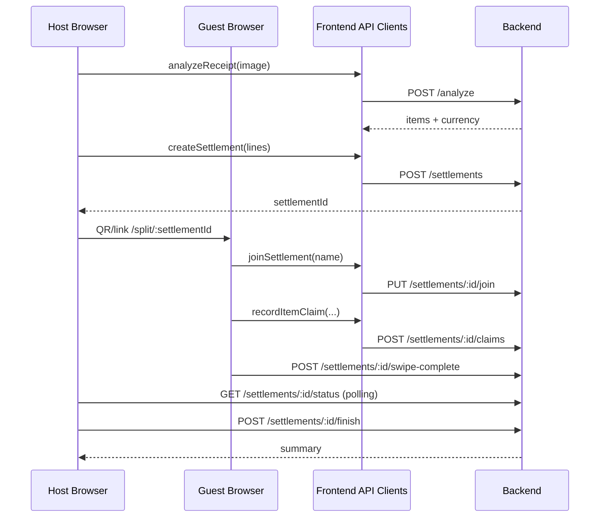

# Frontend (fAIrsplit)

React + Vite + Bun mobile-first PWA for the bill-splitting user journey.

## Core User Flows

Host:
1. `/` -> tap **Scan a Receipt**
2. `/scan` -> upload/capture receipt and run analysis
3. `/review` -> edit line items and create settlement
4. `/share/:settlementId` -> show QR + join link
5. `/swipe/:settlementId` -> host can also claim
6. `/settlement/:settlementId/status` -> monitor participant completion
7. `/summary` -> final split output

Guest:
1. `/join` -> scan QR or paste link/ID
2. `/split/:settlementId` -> enter name and join
3. `/swipe/:settlementId` -> claim quantities
4. guest returns to home after swipe completion

## Stack

- React `19`
- React Router `7`
- TypeScript `5.9`
- Vite `8`
- Bun `1.3`
- Tailwind CSS `4`
- `qrcode.react` for QR generation
- `jsqr` + `BarcodeDetector` fallback chain for QR decoding
- Vitest + Testing Library

## Run

```bash
bun install
bun run dev
```

Build/test:

```bash
bun run build
bun run test
```

## Environment

See `.env.example`.

- `VITE_RECEIPT_SCAN_API_URL`: base URL for `/analyze` calls
- `VITE_SETTLEMENT_API_URL`: base URL for settlement endpoints
- `VITE_PUBLIC_APP_URL`: public origin used in QR/join links

If API URLs are empty, frontend uses internal mock implementations.

## Frontend Architecture

```mermaid
flowchart TB
    A[Pages] --> B[lib/receiptScanApi.ts]
    A --> C[lib/settlementApi.ts]
    A --> D[lib/settlementSession.ts]
    A --> E[components/*]

    B -->|optional HTTP| F[/analyze]
    C -->|optional HTTP| G[/settlements/*]
    C --> H[settlementMockStore]

    D --> I[sessionStorage]
    E --> J[QR create/scan]
```

## Route Map

- `/`: Home
- `/scan`: receipt capture/upload + analyze
- `/review`: editable line-item review and settlement creation
- `/share/:settlementId`: QR/link sharing
- `/join`: QR scan/manual join input
- `/split/:settlementId`: deep-link join page
- `/swipe/:settlementId`: Tinder-like claim UI with quantity overlay
- `/settlement/:settlementId/status`: host polling status page
- `/summary`: final split display

## Integration Details

Receipt analysis:
- `Scan.tsx` encodes selected file into `{ image_base64, mime_type }`.
- `receiptScanApi.analyzeReceipt()` calls backend when `VITE_RECEIPT_SCAN_API_URL` is set.
- Otherwise it returns mock analyze data.

Settlement lifecycle:
- `review -> createSettlement()`
- `joinSettlement()` from deep-link join page
- `recordItemClaim()` during swipe
- `markSwipeComplete()` when done swiping
- host-only `finishSettlement()` on status page

Session state:
- participant ID, owner marker, and currency stored in `sessionStorage` (`gmtm:*` keys)

## Mermaid Sequence (Main Path)



## Unfinished / Main-Path Gaps

- No live sync transport (status uses polling every 2500ms).
- Guests are redirected to home after swipe completion and do not automatically see summary.
- `/summary` has fallback stub data when opened without navigation state.
- No auth/access control on frontend routes (relies on backend openness).
- In mixed configuration, `Swipe` image fetch assumes backend URL exists; with empty API URL this can request `undefined/image/...`.
- Currency behavior depends on backend output; current backend analyze path effectively returns PLN.

## UI/Design Notes

- Global shell with atmospheric blurred gradients (`AppShell`).
- Swipe deck with custom pointer-based hook (`useSwipe`) and programmatic accept/decline.
- Quantity pick overlay for multi-count items.
- QR scanning prefers native `BarcodeDetector`, falls back to `jsQR` with image downscaling.
